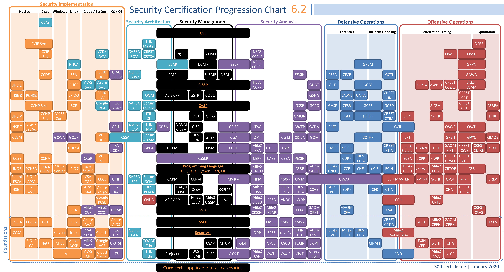

# CyberSecurity Notes

Repo of coursework for BS Cybersecurity. 
[Catlog](./files/19-21-catalog.pdf)

## Classes

| Course | Date | Grade|  
| ------------- | ------------- | ------------- |  
| [Cyber 250](classes/CYBR250/CYBR250.md)  | 11/18/2019  |
| [CIS 313](classes/CIS313/CIS313.md) | 11/18/2019  |
| Content Cell  |

## Links
*  [Guild](https://www.guildeducation.com/) - $1 day to go to school.  
*  [Bellevue Curriculm](https://www.bellevue.edu/degrees/bachelor/cybersecurity-bs-cohort/) - Degree program I'm following
*  [Blackboard Portal](https://cyberactive.bellevue.edu/) - Portal for work.
*  [College Acct Portal](https://bruin.bellevue.edu/) - Portal for university stuff.
*  [Webmail/Office]( https://outlook.office.com) - Yet another portal.
*  [VMWare Desktop](http://WORKSPACE.BELLEVUE.EDU) - Supplied desktop instance for school.

## Podcasts
*  [Darknet Diaries](https://darknetdiaries.com/) - Brings some of the concepts we are learning alive by telling the realworld impact of them.
*  [Getting Into InfoSec](https://gettingintoinfosec.com/) - Hearing how others broke into the industry not only humanizes the experience but also provides some examples.
*  [Internet Storm Center](https://isc.sans.edu/podcast.html) - 5-10 minute daily episodes of what's the biggest item to look for today.  
*  [Security Now](https://twit.tv/shows/security-now) - Steve Gibson takes his time and explains the how/why some bit of news is noteworthy.  

## Map of Certs

